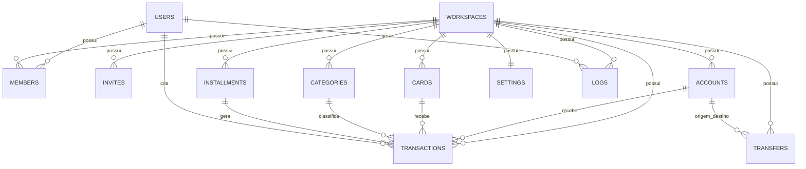

# Database

## Visão Geral

O banco de dados é implementado sobre Google Sheets, com uma aba (sheet) por entidade dentro de uma ou mais planilhas. Todo acesso acontece exclusivamente através do Google Apps Script (ver [API.md](./API.md)) — o frontend nunca lê ou escreve diretamente na planilha.

Convenções gerais adotadas em todas as entidades:

- `id`: string no formato UUID v4, gerado no momento da criação (pelo Apps Script).
- Datas armazenadas em ISO 8601. Campos `datetime` incluem hora (`2026-07-01T14:32:00Z`); campos `date` armazenam apenas a data (`2026-07-01`).
- Toda entidade filha de um Workspace possui obrigatoriamente a coluna `workspaceId` como primeira coluna da sheet (facilita filtragem e leitura em lote).
- Exclusões são preferencialmente **lógicas** (soft delete via `deletedAt`/`archivedAt`), preservando histórico para relatórios e auditoria (Logs).
- Valores monetários (`amount`, `limit`, `balance`) são armazenados como `number` (ponto flutuante com 2 casas decimais). Sugestão de melhoria futura: migrar para inteiros representando centavos, para evitar erros de arredondamento no JavaScript.

### Diagrama de Relacionamento

---

## Users

Representa uma conta de usuário autenticada via Firebase (Google Login). É uma entidade **global**, não pertence a nenhum Workspace.

| Campo | Tipo | Obrigatório | Descrição |
|---|---|---|---|
| id | string (UUID) | Sim | Igual ao `uid` retornado pelo Firebase Authentication. |
| name | string | Sim | Nome exibido, obtido do perfil Google. |
| email | string | Sim | E-mail da conta Google. Único no sistema. |
| photoURL | string | Não | URL da foto de perfil do Google. |
| provider | enum(`"google"`) | Sim | Provedor de autenticação. Fixo em "google" nesta fase. |
| defaultWorkspaceId | string (FK Workspaces.id) | Não | Último Workspace acessado, usado para restaurar sessão direto na tela correta. |
| theme | enum(`"light"` \| `"dark"` \| `"system"`) | Não | Preferência de tema, default `"system"`. |
| createdAt | datetime | Sim | Data do primeiro login. |
| lastLoginAt | datetime | Não | Atualizado a cada login. |

**Relacionamentos**: 1:N com Members, Transactions (createdBy), Logs (userId).

**Índices sugeridos**: único em `email`; único em `id`.

**Observações**: nenhum dado financeiro deve ficar referenciado diretamente ao usuário — sempre via `workspaceId`.

---

## Workspaces

Representa o ambiente financeiro compartilhável. É o "dono" de todos os dados financeiros.

| Campo | Tipo | Obrigatório | Descrição |
|---|---|---|---|
| id | string (UUID) | Sim | Identificador único. |
| name | string | Sim | Nome do Workspace (ex.: "Casa", "Empresa"). |
| ownerId | string (FK Users.id) | Sim | Usuário criador/dono, sempre com role `admin`. |
| currency | string (ISO 4217) | Sim | Moeda padrão do Workspace. Default `"BRL"`. |
| photoURL | string | Não | Ícone/imagem do Workspace. |
| createdAt | datetime | Sim | Data de criação. |
| updatedAt | datetime | Não | Última atualização de metadados. |
| archivedAt | datetime | Não | Preenchido quando o Workspace é arquivado/excluído (soft delete). |

**Relacionamentos**: 1:N com Members, Invites, Accounts, Cards, Categories, Transactions, Installments, Transfers, Logs. 1:1 com Settings.

**Índices sugeridos**: índice por `ownerId` (para listar Workspaces criados por um usuário).

**Observações**: exclusão de Workspace deve ser sempre lógica (`archivedAt`), nunca física, para preservar integridade de relatórios e logs.

---

## Members

Vínculo entre um Usuário e um Workspace, com papel de permissão.

| Campo | Tipo | Obrigatório | Descrição |
|---|---|---|---|
| id | string (UUID) | Sim | Identificador único do vínculo. |
| workspaceId | string (FK Workspaces.id) | Sim | Workspace ao qual pertence. |
| userId | string (FK Users.id) | Sim | Usuário membro. |
| role | enum(`"admin"` \| `"editor"` \| `"viewer"`) | Sim | Nível de permissão (ver regras em BUSINESS_RULES.md). |
| status | enum(`"active"` \| `"removed"`) | Sim | Default `"active"`. |
| invitedBy | string (FK Users.id) | Não | Quem convidou este membro. |
| joinedAt | datetime | Sim | Data em que o convite foi aceito. |
| removedAt | datetime | Não | Preenchido se o membro for removido (soft delete). |

**Relacionamentos**: N:1 com Workspaces e Users.

**Índices sugeridos**: único em (`workspaceId`, `userId`) com `status = active`; índice por `userId` (para listar "meus Workspaces").

**Observações**: o `ownerId` do Workspace também deve possuir um registro em Members com role `admin`, para simplificar consultas de permissão (uma única fonte de verdade para "quem pode o quê").

---

## Invites *(entidade proposta — melhoria)*

Não estava presente na modelagem original, mas é necessária para suportar convite por e-mail (PROJECT.md) de pessoas que ainda não possuem conta, ou que ainda não aceitaram o convite. Sem essa entidade, `Members` não conseguiria representar convites pendentes.

| Campo | Tipo | Obrigatório | Descrição |
|---|---|---|---|
| id | string (UUID) | Sim | Identificador único. |
| workspaceId | string (FK Workspaces.id) | Sim | Workspace de destino. |
| email | string | Sim | E-mail convidado. |
| role | enum(`"admin"` \| `"editor"` \| `"viewer"`) | Sim | Papel que será atribuído ao aceitar. |
| token | string | Sim | Token único usado no link de aceite. |
| status | enum(`"pending"` \| `"accepted"` \| `"expired"` \| `"revoked"`) | Sim | Default `"pending"`. |
| invitedBy | string (FK Users.id) | Sim | Quem enviou o convite. |
| createdAt | datetime | Sim | Data de criação. |
| expiresAt | datetime | Não | Sugestão: expirar em 7 dias. |
| acceptedAt | datetime | Não | Preenchido ao aceitar. |

**Relacionamentos**: N:1 com Workspaces. Ao ser aceito, gera um registro em Members.

**Índices sugeridos**: único em `token`; índice em (`workspaceId`, `email`).

---

## Accounts

Contas financeiras (bancárias, carteira, dinheiro) pertencentes ao Workspace.

| Campo | Tipo | Obrigatório | Descrição |
|---|---|---|---|
| id | string (UUID) | Sim | Identificador único. |
| workspaceId | string (FK Workspaces.id) | Sim | Workspace dono da conta. |
| name | string | Sim | Nome da conta (ex.: "Nubank", "Carteira"). |
| type | enum(`"checking"` \| `"savings"` \| `"wallet"` \| `"cash"` \| `"other"`) | Sim | Tipo de conta. |
| institution | string | Não | Instituição/banco (ex.: "Nubank", "Inter"). |
| balance | number | Sim | Saldo atual da conta. Default `0`. |
| color | string (hex) | Não | Cor de identificação visual. |
| icon | string | Não | Ícone associado. |
| includeInTotal | boolean | Sim | Se este saldo entra no total consolidado do Dashboard. Default `true`. |
| archivedAt | datetime | Não | Soft delete. |
| createdAt | datetime | Sim | Data de criação. |
| updatedAt | datetime | Não | Última atualização. |

**Relacionamentos**: N:1 com Workspaces. 1:N com Transactions (`accountId`) e Transfers (`fromAccountId`/`toAccountId`).

**Índices sugeridos**: índice por `workspaceId`.

**Observações**: `balance` é atualizado automaticamente pelo backend (nunca editado diretamente pelo usuário) — ver regra "Atualização automática dos saldos" em BUSINESS_RULES.md.

---

## Cards

Cartões de crédito vinculados ao Workspace.

| Campo | Tipo | Obrigatório | Descrição |
|---|---|---|---|
| id | string (UUID) | Sim | Identificador único. |
| workspaceId | string (FK Workspaces.id) | Sim | Workspace dono do cartão. |
| name | string | Sim | Nome do cartão. |
| limit | number | Sim | Limite total do cartão. |
| closingDay | number (1–31) | Sim | Dia de fechamento da fatura. |
| dueDay | number (1–31) | Sim | Dia de vencimento da fatura. |
| brand | enum(`"visa"` \| `"mastercard"` \| `"elo"` \| `"amex"` \| `"other"`) | Não | Bandeira do cartão. |
| institution | string | Não | Banco emissor. |
| color | string (hex) | Não | Cor de identificação visual. |
| billingAccountId | string (FK Accounts.id) | Não | Conta usada para pagar a fatura (usada para projeções futuras). |
| archivedAt | datetime | Não | Soft delete. |
| createdAt | datetime | Sim | Data de criação. |
| updatedAt | datetime | Não | Última atualização. |

**Relacionamentos**: N:1 com Workspaces e Accounts (`billingAccountId`). 1:N com Transactions (`cardId`).

**Índices sugeridos**: índice por `workspaceId`.

**Observações**: `limite disponível` e `fatura atual/próxima` são **calculados**, não armazenados (ver API.md → Card.getSummary).

---

## Categories

Categorias de receitas e despesas, personalizáveis por Workspace.

| Campo | Tipo | Obrigatório | Descrição |
|---|---|---|---|
| id | string (UUID) | Sim | Identificador único. |
| workspaceId | string (FK Workspaces.id) | Sim | Workspace dono da categoria. |
| name | string | Sim | Nome da categoria. |
| type | enum(`"income"` \| `"expense"`) | Sim | Tipo de lançamento ao qual se aplica. |
| color | string (hex) | Não | Cor de identificação. |
| icon | string | Não | Ícone associado. |
| parentId | string (FK Categories.id) | Não | Permite subcategorias (ex.: "Mercado" → "Feira"). |
| isDefault | boolean | Sim | Indica categoria padrão criada automaticamente ao criar o Workspace. Default `false`. |
| archivedAt | datetime | Não | Soft delete. |
| createdAt | datetime | Sim | Data de criação. |

**Relacionamentos**: N:1 com Workspaces e auto-relacionamento (`parentId`). 1:N com Transactions e Installments.

**Índices sugeridos**: índice por (`workspaceId`, `type`).

**Observações**: ao criar um novo Workspace, o sistema deve popular categorias padrão (Mercado, Combustível, Farmácia, Educação, Casa, Internet, Lazer, Streaming, Viagem, Investimentos, Salário, Extras, Freelancer), conforme PROJECT.md.

---

## Transactions

Entidade central: representa **todo lançamento financeiro** (receita ou despesa), incluindo cada parcela individual gerada por um plano de parcelamento.

| Campo | Tipo | Obrigatório | Descrição |
|---|---|---|---|
| id | string (UUID) | Sim | Identificador único. |
| workspaceId | string (FK Workspaces.id) | Sim | Workspace dono do lançamento. |
| type | enum(`"income"` \| `"expense"`) | Sim | Tipo do lançamento. |
| description | string | Sim | Descrição do lançamento. |
| amount | number | Sim | Valor (sempre positivo; o sinal é implícito pelo `type`). |
| date | date | Sim | Data efetiva do lançamento (data da parcela, no caso de parceladas). |
| categoryId | string (FK Categories.id) | Sim | Categoria do lançamento. |
| accountId | string (FK Accounts.id) | Condicional | Obrigatório quando `paymentMethod` for `"pix"`, `"cash"`, `"debit"`, `"boleto"` ou `"transfer"`. |
| cardId | string (FK Cards.id) | Condicional | Obrigatório quando `paymentMethod` for `"credit"`. |
| paymentMethod | enum(`"pix"` \| `"cash"` \| `"debit"` \| `"credit"` \| `"boleto"`) | Sim | Forma de pagamento (aplica-se somente a despesas; receitas usam `"pix"`/`"cash"`/`"debit"` para indicar onde o valor entrou). |
| paymentPeriod | enum(`"start_of_month"` \| `"fortnight"`) | Condicional | Somente para despesas: define planejamento por quinzena (ver BUSINESS_RULES.md). |
| isRecurring | boolean | Sim | Default `false`. |
| recurrenceGroupId | string (UUID) | Não | Agrupa lançamentos recorrentes gerados a partir de um mesmo modelo. |
| installmentPlanId | string (FK Installments.id) | Não | Preenchido quando o lançamento é uma parcela de compra parcelada. |
| installmentNumber | number | Não | Número da parcela (ex.: `3`). Preenchido junto com `installmentPlanId`. |
| installmentTotal | number | Não | Total de parcelas do plano (denormalizado para exibição rápida, ex.: "3/12"). |
| notes | string | Não | Observações livres. |
| attachmentURL | string | Não | Comprovante (funcionalidade futura). |
| createdBy | string (FK Users.id) | Sim | Usuário que criou o lançamento. |
| updatedBy | string (FK Users.id) | Não | Último usuário a editar. |
| createdAt | datetime | Sim | Data de criação do registro. |
| updatedAt | datetime | Não | Última atualização. |
| deletedAt | datetime | Não | Soft delete (permite "excluir apenas esta parcela" sem quebrar o histórico das demais). |

**Relacionamentos**: N:1 com Workspaces, Categories, Accounts, Cards, Installments, Users (`createdBy`/`updatedBy`).

**Índices sugeridos**: índice por (`workspaceId`, `date`); índice por (`workspaceId`, `cardId`); índice por (`workspaceId`, `accountId`); índice por `installmentPlanId`; índice por `recurrenceGroupId`.

**Observações**: unifica "Receitas" e "Despesas" em uma única entidade (`type` diferencia), evitando duplicação de schema e simplificando relatórios/filtros combinados. Essa é uma melhoria em relação à documentação original, que tratava as duas como conceitos separados.

---

## Installments

Representa o **plano** de uma compra parcelada (o "cabeçalho"), usado para gerar e gerenciar em conjunto as parcelas (`Transactions`).

| Campo | Tipo | Obrigatório | Descrição |
|---|---|---|---|
| id | string (UUID) | Sim | Identificador único do plano. |
| workspaceId | string (FK Workspaces.id) | Sim | Workspace dono do plano. |
| description | string | Sim | Descrição da compra (ex.: "Notebook"). |
| totalAmount | number | Sim | Valor total da compra. |
| installmentsCount | number | Sim | Quantidade de parcelas (ex.: `12`). |
| installmentAmount | number | Sim | Valor de cada parcela (`totalAmount / installmentsCount`, arredondado; a última parcela absorve a diferença de arredondamento). |
| startDate | date | Sim | Data da primeira parcela. |
| categoryId | string (FK Categories.id) | Sim | Categoria aplicada a todas as parcelas. |
| cardId | string (FK Cards.id) | Não | Cartão utilizado (quando aplicável). |
| accountId | string (FK Accounts.id) | Não | Conta utilizada (quando não for no cartão). |
| createdBy | string (FK Users.id) | Sim | Usuário que criou o plano. |
| status | enum(`"active"` \| `"completed"` \| `"cancelled"`) | Sim | Default `"active"`. |
| createdAt | datetime | Sim | Data de criação. |
| updatedAt | datetime | Não | Última atualização (ex.: edição em lote). |

**Relacionamentos**: N:1 com Workspaces, Categories, Cards, Accounts, Users. 1:N com Transactions.

**Índices sugeridos**: índice por `workspaceId`.

**Observações**: ao criar um plano, o backend gera automaticamente `installmentsCount` registros em `Transactions`, cada um com `installmentPlanId`, `installmentNumber` e `date` incrementada mês a mês a partir de `startDate`.

---

## Transfers *(entidade proposta — melhoria)*

Movimentações entre contas do mesmo Workspace, que não alteram o patrimônio total (mencionadas em PROJECT.md, ausentes na modelagem original).

| Campo | Tipo | Obrigatório | Descrição |
|---|---|---|---|
| id | string (UUID) | Sim | Identificador único. |
| workspaceId | string (FK Workspaces.id) | Sim | Workspace dono da transferência. |
| fromAccountId | string (FK Accounts.id) | Sim | Conta de origem. |
| toAccountId | string (FK Accounts.id) | Sim | Conta de destino (deve ser diferente de `fromAccountId`). |
| amount | number | Sim | Valor transferido. |
| date | date | Sim | Data da transferência. |
| notes | string | Não | Observações. |
| createdBy | string (FK Users.id) | Sim | Usuário que realizou a transferência. |
| createdAt | datetime | Sim | Data de criação. |
| deletedAt | datetime | Não | Soft delete. |

**Relacionamentos**: N:1 com Workspaces, Accounts (origem e destino), Users.

**Índices sugeridos**: índice por (`workspaceId`, `date`).

**Observações**: **não** gera registros em `Transactions` (não é receita nem despesa) — apenas debita `fromAccountId.balance` e credita `toAccountId.balance`.

---

## Settings

Configurações do Workspace (relação 1:1).

| Campo | Tipo | Obrigatório | Descrição |
|---|---|---|---|
| id | string (UUID) | Sim | Identificador único. |
| workspaceId | string (FK Workspaces.id) | Sim | Único — um registro por Workspace. |
| fortnightSplitDay | number (1–28) | Sim | Dia do mês que define o corte entre "início do mês" e "quinzena". Default `15`. |
| monthStartDay | number (1–28) | Sim | Dia considerado início do mês financeiro (para usuários que fecham o mês fora do dia 1). Default `1`. |
| theme | enum(`"light"` \| `"dark"` \| `"system"`) | Não | Tema padrão do Workspace (pode ser sobrescrito pela preferência pessoal do usuário). |
| notificationsEnabled | boolean | Sim | Default `true`. |
| defaultAccountId | string (FK Accounts.id) | Não | Conta pré-selecionada ao criar novos lançamentos. |
| createdAt | datetime | Sim | Data de criação. |
| updatedAt | datetime | Não | Última atualização. |

**Relacionamentos**: 1:1 com Workspaces.

**Índices sugeridos**: único em `workspaceId`.

---

## Logs

Auditoria de ações realizadas dentro de um Workspace.

| Campo | Tipo | Obrigatório | Descrição |
|---|---|---|---|
| id | string (UUID) | Sim | Identificador único. |
| workspaceId | string (FK Workspaces.id) | Sim | Workspace onde a ação ocorreu. |
| userId | string (FK Users.id) | Sim | Usuário que executou a ação. |
| action | enum(`"create"` \| `"update"` \| `"delete"` \| `"invite"` \| `"remove_member"` \| `"role_change"` \| `"login"`) | Sim | Tipo de ação. |
| entity | string | Sim | Nome da entidade afetada (ex.: `"Transaction"`, `"Card"`). |
| entityId | string | Sim | Id do registro afetado. |
| description | string | Não | Resumo legível (ex.: "Excluiu despesa 'Mercado'"). |
| metadata | string (JSON) | Não | Diff before/after, quando aplicável. |
| createdAt | datetime | Sim | Data/hora da ação. |

**Relacionamentos**: N:1 com Workspaces e Users.

**Índices sugeridos**: índice por (`workspaceId`, `createdAt`); índice por (`workspaceId`, `entity`, `entityId`).

**Observações**: Logs nunca são editados ou excluídos (append-only).

---

## Melhorias Propostas Nesta Modelagem

1. **Unificação de Receitas/Despesas** em `Transactions` com campo `type` — reduz duplicação de schema, services e telas de relatório.
2. **Entidade `Invites`** adicionada para suportar convite por e-mail a pessoas sem conta ainda.
3. **Entidade `Transfers`** adicionada para movimentações entre contas sem afetar patrimônio total.
4. **Soft delete generalizado** (`deletedAt`/`archivedAt`) em vez de exclusão física, permitindo histórico, auditoria (Logs) e a regra de "excluir apenas esta parcela".
5. **`installmentPlanId` + `installmentNumber` + `installmentTotal`** em `Transactions`, referenciando `Installments`, permitindo ações em lote (editar/excluir todas as parcelas) sem perder a granularidade individual.
6. **`Settings` por Workspace** (não por usuário) centraliza a configuração de quinzena (`fortnightSplitDay`), essencial para o cálculo do Dashboard.
7. Sugestão futura (não obrigatória agora): migrar valores monetários para inteiros em centavos, evitando problemas de ponto flutuante em JavaScript.
