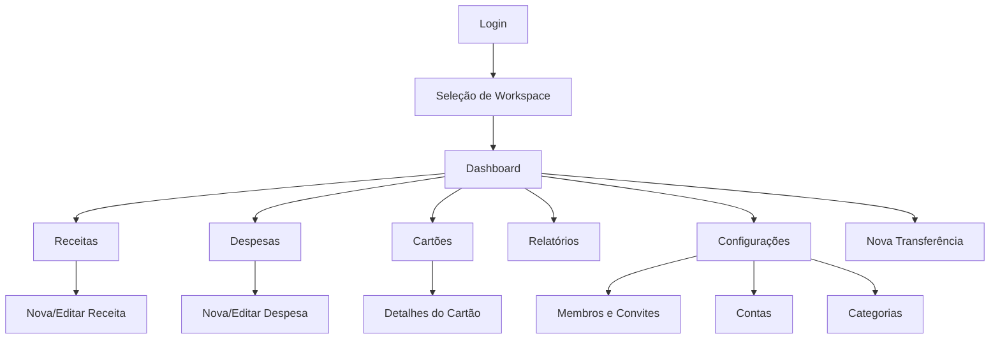

# Screens

## Visão Geral

Esta é uma SPA: todas as telas abaixo são rotas renderizadas dentro do mesmo `index.html` pelo Router (`/js/router`). Convenção de rota entre colchetes. Permissões seguem a Matriz de Permissões definida em [BUSINESS_RULES.md](./BUSINESS_RULES.md).

### Mapa de Navegação

---

## Login

**Rota**: `/login`

**Objetivo**: autenticar o usuário via Firebase (Google Login) e redirecioná-lo para o Workspace mais recente (`defaultWorkspaceId`) ou para a seleção de Workspace.

**Componentes**: logo/marca do app, ilustração, botão de login.

**Campos**: nenhum (autenticação via popup/redirect do Google).

**Botões**:
- "Entrar com Google" (primário).

**Ações**:
- Ao clicar, dispara `authService.loginWithGoogle()` → Firebase Auth → `auth.verify` na API → redireciona.
- Se já houver sessão ativa (restaurada automaticamente), pula direto para o Dashboard/Workspace Switcher.

**Permissões**: pública (não autenticado).

**Navegação**: sucesso → `/workspaces` (se 0 ou 2+ Workspaces) ou direto `/dashboard` (se exatamente 1 Workspace ou `defaultWorkspaceId` definido).

---

## Seleção de Workspace

**Rota**: `/workspaces`

**Objetivo**: listar os Workspaces do usuário e permitir criar um novo ou aceitar convites pendentes.

**Componentes**: lista de Cards de Workspace (nome, foto, papel do usuário), Card de "Criar novo Workspace", lista de convites pendentes (se houver, via e-mail correspondente).

**Campos** (modal "Criar Workspace"): nome (obrigatório), moeda (default BRL), foto (opcional).

**Botões**: "Criar Workspace", "Entrar" (por Workspace), "Aceitar convite" / "Recusar convite".

**Ações**:
- `workspace.list` ao carregar a tela.
- `workspace.create` ao confirmar o modal.
- `workspace.acceptInvite` ao aceitar convite.
- Seleção de um Workspace grava `state.workspace` e atualiza `defaultWorkspaceId` do usuário.

**Permissões**: qualquer usuário autenticado.

**Navegação**: ao selecionar/criar um Workspace → `/dashboard`.

---

## Dashboard

**Rota**: `/dashboard`

**Objetivo**: visão consolidada do mês corrente do Workspace ativo.

**Componentes**:
- Header com foto do usuário, nome, saudação dinâmica ("Bom dia, Maria").
- Card de Saldo do Mês.
- Cards de Receitas/Despesas do mês.
- Card de Economia do mês (`totalIncome - totalExpense`, com indicador percentual).
- Resumo de Quinzena (início do mês vs. quinzena).
- Carrossel/lista de Cartões (limite usado/disponível, fatura atual).
- Lista de Próximos Vencimentos (parcelas/faturas a vencer nos próximos 7 dias).
- Lista de Últimos Lançamentos (5–10 mais recentes).
- Gráfico mensal (linha/barra, receitas x despesas dos últimos 6–12 meses).
- Resumo anual (totais do ano corrente).
- Bottom Navigation (mobile) / Sidebar (desktop).
- Seletor de mês/ano (setas ◀ ▶ + label "Julho 2026").

**Campos**: nenhum formulário direto; filtro de mês/ano.

**Botões**: atalhos rápidos "+ Receita", "+ Despesa", "+ Transferência" (FAB — Floating Action Button no mobile).

**Ações**: `dashboard.getSummary({ month, year })` ao carregar/alterar o filtro de mês.

**Permissões**: todos os papéis (somente leitura); FABs de criação ocultos para `viewer`.

**Navegação**: cliques nos Cards levam às respectivas telas (Cartões → Detalhes do Cartão; "Ver todas" em Últimos Lançamentos → Receitas/Despesas).

---

## Receitas (Lista)

**Rota**: `/incomes`

**Objetivo**: listar, filtrar e pesquisar todas as receitas do Workspace.

**Componentes**: barra de busca, filtros (período, categoria, conta, usuário), lista/tabela de receitas (descrição, categoria, valor, data, autor), estado vazio ilustrado.

**Campos de filtro**: `startDate`, `endDate`, `categoryId`, `accountId`, `createdBy`, `search`.

**Botões**: "+ Nova Receita" (FAB/topo), ação de editar/excluir por item (menu contextual/swipe no mobile).

**Ações**: `transaction.list({ type: "income", ... })`; `transaction.delete` (com confirmação via Dialog).

**Permissões**: leitura para todos; criar/editar/excluir somente `admin`/`editor`.

**Navegação**: "+ Nova Receita" → modal/tela "Nova Receita"; item → modal/tela "Editar Receita".

---

## Nova / Editar Receita

**Rota**: `/incomes/new` · `/incomes/:id/edit` (ou modal sobre `/incomes`)

**Objetivo**: cadastrar ou editar uma receita.

**Componentes**: formulário (Inputs, Select, DatePicker, Switch), Toast de confirmação.

**Campos**: descrição* , valor*, data*, categoria* (`type=income`), conta de destino*, recorrente (switch) → se ativado, exibe campo "repetir por quantos meses" (default 12), observações.

**Botões**: "Salvar", "Cancelar", (na edição) "Excluir".

**Ações**: `transaction.create` / `transaction.update`; se recorrente, backend gera ocorrências futuras automaticamente.

**Permissões**: `admin`/`editor`.

**Navegação**: ao salvar → volta para `/incomes` com Toast de sucesso.

---

## Despesas (Lista)

**Rota**: `/expenses`

**Objetivo**: listar, filtrar e pesquisar todas as despesas do Workspace.

**Componentes**: idêntico à tela de Receitas, com colunas adicionais: forma de pagamento, conta/cartão, badge de parcela (ex.: "3/12"), badge de período (Início do mês/Quinzena).

**Campos de filtro**: `startDate`, `endDate`, `categoryId`, `accountId`, `cardId`, `paymentMethod`, `createdBy`, `search`.

**Botões**: "+ Nova Despesa" (FAB/topo), ação de editar/excluir por item.

**Ações**: `transaction.list({ type: "expense", ... })`; `transaction.delete` — se a despesa pertence a um parcelamento, o Dialog de confirmação oferece "Excluir apenas esta parcela" ou "Excluir todas as parcelas futuras".

**Permissões**: leitura para todos; criar/editar/excluir somente `admin`/`editor`.

**Navegação**: "+ Nova Despesa" → tela "Nova Despesa"; item → tela "Editar Despesa".

---

## Nova / Editar Despesa

**Rota**: `/expenses/new` · `/expenses/:id/edit`

**Objetivo**: cadastrar ou editar uma despesa, incluindo o fluxo de parcelamento.

**Componentes**: formulário multi-seção (Dados gerais, Pagamento, Planejamento), Switch "Compra parcelada", campo numérico de parcelas (exibido somente se parcelada), preview do valor de cada parcela.

**Campos**:
- descrição*, valor* (ou "valor total" se parcelada), data*, categoria* (`type=expense`).
- forma de pagamento* (PIX, Dinheiro, Débito, Crédito, Boleto).
- conta* (se forma ≠ crédito) **ou** cartão* (se forma = crédito).
- parcelado (switch) → número de parcelas* (2–60, somente se ativado).
- período* (Início do mês / Quinzena).
- recorrente (switch, desabilitado se "parcelado" estiver ativo — mutuamente exclusivos).
- observações.

**Botões**: "Salvar", "Cancelar", (na edição, se pertence a um plano) opções "Salvar apenas esta parcela" / "Salvar todas as parcelas futuras"; (na edição) "Excluir".

**Ações**: `transaction.create` (compra simples) ou `installment.create` (compra parcelada); `transaction.update`/`transaction.delete` com `applyToAllInstallments`.

**Permissões**: `admin`/`editor`.

**Navegação**: ao salvar → volta para `/expenses` com Toast de sucesso.

---

## Cartões (Lista)

**Rota**: `/cards`

**Objetivo**: listar os cartões cadastrados no Workspace com resumo visual (estilo "carteira" de cartões, inspirado em apps bancários).

**Componentes**: carrossel/lista de Cards visuais (nome, bandeira, cor, limite usado em barra de progresso), botão "+ Novo Cartão".

**Campos**: nenhum na listagem.

**Botões**: "+ Novo Cartão", tap no card → Detalhes do Cartão.

**Ações**: `card.list()`.

**Permissões**: leitura para todos; criação somente `admin`/`editor`.

**Navegação**: tap no cartão → `/cards/:id`.

---

## Detalhes do Cartão

**Rota**: `/cards/:id`

**Objetivo**: exibir informações completas de um cartão: limite, fatura atual/próxima, compras e parcelamentos, histórico.

**Componentes**: header com dados do cartão (editável via menu), Cards de resumo (Limite, Disponível, Utilizado), Tabs ("Fatura Atual", "Próxima Fatura", "Compras", "Parcelamentos", "Histórico"), lista de transações da fatura selecionada.

**Campos** (modal de edição do cartão): nome, limite, dia de fechamento, dia de vencimento, bandeira, banco, cor, conta de pagamento (opcional).

**Botões**: "Editar Cartão", "Arquivar Cartão", "+ Nova Despesa neste Cartão".

**Ações**: `card.getSummary({ cardId })`; `card.update`; `card.archive`; `transaction.list({ cardId })`.

**Permissões**: leitura para todos; edição/arquivamento somente `admin`/`editor`.

**Navegação**: "+ Nova Despesa neste Cartão" → tela "Nova Despesa" com `cardId` e `paymentMethod=credit` pré-preenchidos.

---

## Contas

**Rota**: `/accounts`

**Objetivo**: gerenciar as contas financeiras do Workspace (bancárias, carteira, dinheiro).

**Componentes**: lista de Cards de conta (nome, instituição, saldo atual, cor), botão "+ Nova Conta".

**Campos** (modal Nova/Editar Conta): nome*, tipo* (conta corrente, poupança, carteira, dinheiro, outro), instituição, cor, ícone, incluir no total do Dashboard (switch).

**Botões**: "+ Nova Conta", "Editar", "Arquivar".

**Ações**: `account.list`, `account.create`, `account.update`, `account.archive`.

**Permissões**: leitura para todos; escrita somente `admin`/`editor`.

**Navegação**: tap na conta → detalhe simples (extrato filtrado por `accountId`, reaproveitando a lista de Despesas/Receitas com filtro aplicado).

---

## Categorias

**Rota**: `/categories`

**Objetivo**: gerenciar categorias de receitas e despesas.

**Componentes**: Tabs "Receitas"/"Despesas", lista de categorias com cor/ícone, suporte a subcategorias (indentadas).

**Campos** (modal Nova/Editar Categoria): nome*, tipo* (income/expense — fixo pela Tab ativa), cor, ícone, categoria pai (opcional).

**Botões**: "+ Nova Categoria", "Editar", "Arquivar".

**Ações**: `category.list`, `category.create`, `category.update`, `category.archive`.

**Permissões**: leitura para todos; escrita somente `admin`/`editor`. Categorias com `isDefault=true` não podem ser arquivadas.

**Navegação**: tela isolada, acessível a partir de Configurações ou dos formulários de Receita/Despesa ("Gerenciar categorias").

---

## Nova Transferência

**Rota**: `/transfers/new` (modal sobre Dashboard ou Contas)

**Objetivo**: registrar movimentação de valores entre duas contas do Workspace.

**Componentes**: formulário simples com seleção visual de conta origem → destino (estilo "de/para").

**Campos**: conta de origem*, conta de destino*, valor*, data*, observações.

**Botões**: "Transferir", "Cancelar".

**Ações**: `transfer.create` (valida `fromAccountId !== toAccountId`).

**Permissões**: `admin`/`editor`.

**Navegação**: ao concluir → volta para a tela de origem (Dashboard/Contas) com Toast de sucesso e saldos atualizados.

---

## Relatórios

**Rota**: `/reports`

**Objetivo**: gerar relatórios financeiros analíticos.

**Componentes**: seletor de tipo de relatório (Mensal, Anual, Por categoria, Por cartão, Por conta, Por usuário), filtros de período, gráficos (pizza/barra/linha conforme o tipo), tabela detalhada, botões de exportação.

**Campos**: `type`, `startDate`, `endDate`.

**Botões**: "Gerar Relatório", "Exportar PDF", "Exportar Excel".

**Ações**: `report.generate`.

**Permissões**: leitura para todos os papéis.

**Navegação**: tela isolada, acessível pela Sidebar/Bottom Navigation.

---

## Configurações

**Rota**: `/settings`

**Objetivo**: gerenciar preferências do Workspace, membros e conta do usuário.

**Componentes**: Tabs/seções — "Geral" (nome/foto/moeda do Workspace, dia de corte da quinzena, dia de início do mês), "Aparência" (tema claro/escuro/sistema), "Membros" (lista + convites), "Contas & Cartões" (atalhos), "Categorias" (atalho), "Perfil" (dados do usuário logado, botão Sair).

**Campos**: conforme `Settings` (ver database.md) + dados de `Workspace` (nome, moeda, foto) restritos a `admin`.

**Botões**: "Salvar alterações", "Convidar membro", "Remover membro", "Alterar papel", "Sair do Workspace", "Arquivar Workspace" (somente `ownerId`), "Sair da conta" (logout).

**Ações**: `settings.get`, `settings.update`, `workspace.update`, `workspace.listMembers`, `workspace.inviteMember`, `workspace.updateMemberRole`, `workspace.removeMember`, `workspace.archive`, `auth.logout`.

**Permissões**: seção "Geral"/"Membros"/"Arquivar Workspace" restritas a `admin` (arquivar restrito a `ownerId`); seção "Perfil"/"Aparência" disponíveis a todos.

**Navegação**: acessível pela Sidebar/Bottom Navigation; "Sair da conta" → `/login`.

---

## Componentes Globais (presentes em todas as telas autenticadas)

- **Header**: logo/nome do Workspace ativo (com troca rápida de Workspace), avatar do usuário.
- **Sidebar** (desktop) / **Bottom Navigation** (mobile): Dashboard, Receitas, Despesas, Cartões, Relatórios, Configurações.
- **FAB** (mobile): atalho para "+ Nova Despesa"/"+ Nova Receita"/"+ Transferência" (menu expansível).
- **Toast**: feedback de sucesso/erro para toda ação de escrita.
- **Dialog de confirmação**: usado em toda exclusão, especialmente parcelas/recorrências (com opções "apenas este"/"todos").
- **Modal**: usado para formulários rápidos (Nova Conta, Nova Categoria, Nova Transferência) sem sair da tela atual.